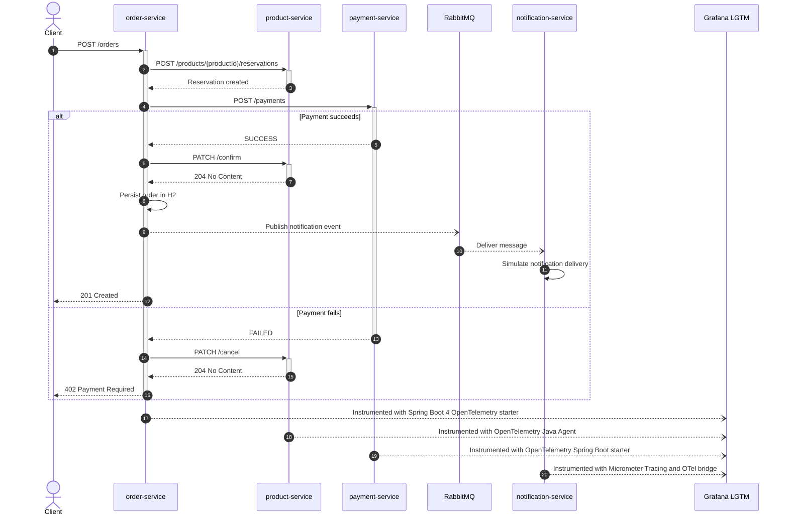

# Observability POC

This repository is a proof of concept for comparing observability instrumentation strategies across Spring Boot services running different Java versions. The system models a distributed checkout flow with HTTP calls, in-memory databases, RabbitMQ messaging, and OTLP export to a Grafana LGTM stack.

## What This POC Compares

| Service | Spring Boot | Java | Port | Instrumentation strategy |
| --- | ---: | ---: | ---: | --- |
| `product-service` | `3.5.13` | `17` | `8081` | OpenTelemetry Java Agent plus lightweight OpenTelemetry API usage |
| `payment-service` | `3.5.13` | `21` | `8082` | OpenTelemetry Spring Boot Starter |
| `notification-service` | `3.5.13` | `25` | `8083` | Micrometer Tracing bridge to OpenTelemetry |
| `order-service` | `4.0.4` | `25` | `8080` | Spring Boot 4 native OpenTelemetry starter |

The goal is not domain completeness. The goal is to compare operational effort, code coupling, configuration complexity, and signal quality for traces, metrics, logs, SQL spans, HTTP propagation, async execution, and RabbitMQ propagation.

## Architecture

Main flow:

1. A client calls `POST /orders` on `order-service`.
2. `order-service` calls `product-service` to create a stock reservation.
3. `order-service` calls `payment-service` to process the payment.
4. If payment succeeds, the reservation is confirmed; if it fails, the reservation is canceled.
5. `order-service` persists the order in H2.
6. `order-service` publishes a notification message to RabbitMQ.
7. `notification-service` consumes the message and simulates notification delivery.

## Sequence Diagram



## Runtime Stack

The root `docker-compose.yaml` starts:

- `grafana-lgtm`: Grafana LGTM all-in-one image.
- `rabbit`: RabbitMQ with the management UI enabled.
- `product-service`
- `payment-service`
- `notification-service`
- `order-service`

Host-accessible URLs:

| Component | URL | Notes |
| --- | --- | --- |
| Order API | `http://localhost:8080` | Main entry point for the checkout flow |
| Grafana | `http://localhost:3000` | Explore traces, logs, and metrics |
| RabbitMQ Management | `http://localhost:15672` | Login with `admin` / `admin` |
| OTLP HTTP | `http://localhost:4318` | Used by services for OTLP export |
| OTLP gRPC | `localhost:4317` | Exposed by the LGTM container |

## Requirements

To run the full stack, you need:

- Git.
- Docker Engine with Docker Compose v2.
- Internet access during the first build, because Docker images and Maven dependencies must be downloaded.
- Available local ports: `3000`, `4317`, `4318`, `5672`, `15672`, and `8080`.
- Enough local resources to build and run all containers. A practical baseline is 4 CPU cores and 6 GB of available RAM.

You do not need to install Java or Maven locally to run the stack through Docker Compose. Each service is built inside its own Docker image using the Maven Wrapper.

Quick checks:

```bash
git --version
docker --version
docker compose version
```

## Run The Full Stack

1. Clone the repository if you do not have it locally yet.

```bash
git clone https://github.com/apelisser/observability.git
cd observability
```

If you already cloned the repository, just start from its root directory.

2. Build and start every service.

```bash
docker compose up -d --build
```

3. Wait until the stack is healthy. The `grafana-lgtm` and `rabbit` services have health checks; application services start after their required dependencies.

4. Open Grafana:

```text
http://localhost:3000
```

Use Grafana Explore to inspect traces, logs, and metrics exported through OTLP.

5. Open RabbitMQ Management:

```text
http://localhost:15672
```

Credentials:

```text
username: admin
password: admin
```

The Compose file creates the `observability` virtual host and grants permissions to the `admin` user.

6. Trigger the distributed checkout flow.

```bash
curl -i -X POST http://localhost:8080/orders \
  -H 'Content-Type: application/json' \
  -d '{
    "productId": "product-001",
    "quantity": 2,
    "unitPrice": 49.90,
    "customerId": "customer-001",
    "currency": "BRL",
    "paymentMethod": "credit_card"
  }'
```

7. Check the result.

Expected outcomes:

- `201 Created` when stock reservation and payment succeed.
- `402 Payment Required` when `payment-service` simulates a payment failure.
- `X-Trace-Id` response header on services that expose the active trace ID.

8. Stop the stack when finished.

```bash
docker compose down -v
```

## Useful Commands

Start only infrastructure:

```bash
docker compose up -d grafana-lgtm rabbit
```

Rebuild and start one service:

```bash
docker compose up -d --build order-service
```

Follow logs:

```bash
docker compose logs -f order-service payment-service product-service notification-service
```

## Instrumentation Trade-Offs

| Strategy | Strength | Cost |
| --- | --- | --- |
| Java Agent | Fast adoption and low application intrusion | Runtime dependency on agent compatibility and less fine-grained application control |
| OTel Spring Boot Starter | Good auto-instrumentation with explicit application dependency | Direct coupling to OpenTelemetry instrumentation libraries |
| Micrometer bridge OTel | Aligns with Spring/Micrometer abstractions | More application wiring and configuration ownership |
| Spring Boot 4 OTel | Closest to Spring Boot's newer native observability model | Requires newer Spring Boot baseline and complementary dependency alignment |

## Current Observations

- `product-service` is primarily Java Agent based, but it now includes `opentelemetry-api` to expose `X-Trace-Id` from application code.
- Sampling is configured at `100%`, which is appropriate for this POC but not a production default.
- H2 databases are in-memory and use `create-drop`, so data is ephemeral.

## Service Documentation

- `microservices/order/README.md`
- `microservices/product/README.md`
- `microservices/payment/README.md`
- `microservices/notification/README.md`
